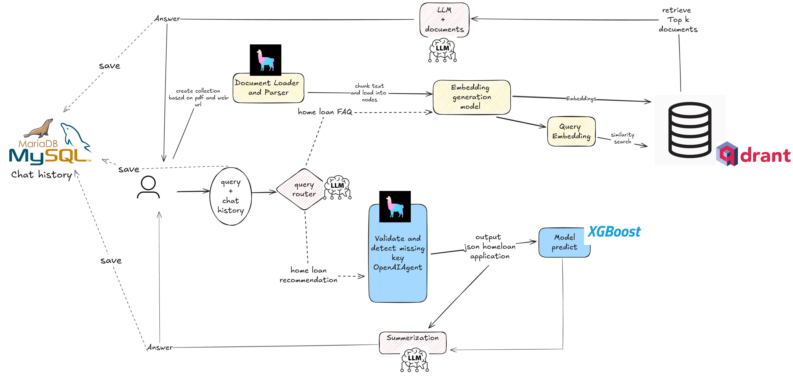
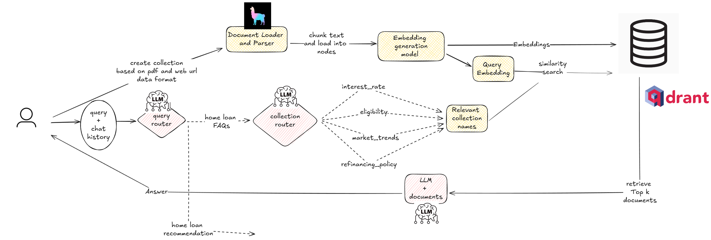
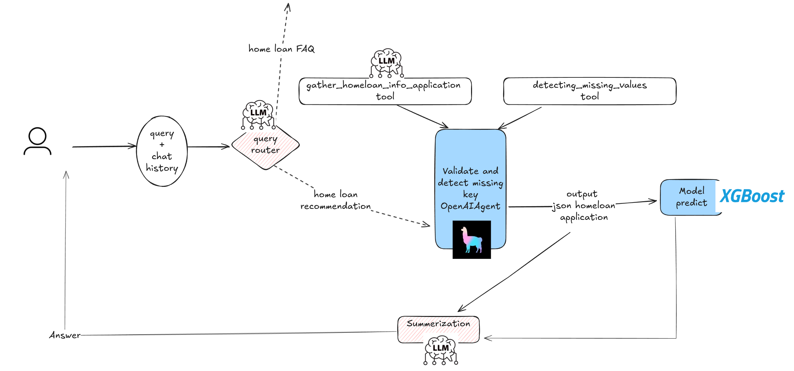
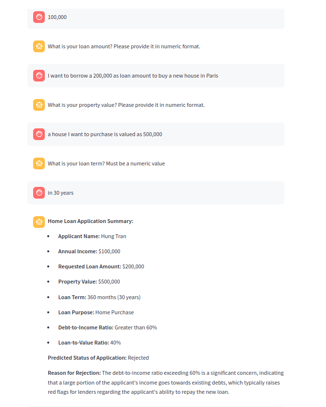

# LLM chat bot - intelligent document processing for home loan applications 
In this project, I leverage the LLM power to create a chat bot, two services is deployed so far in ly application:
- FAQ home loan question for different user concerning topic such as market trends, eligibility, etc
- Automate document processing tasks for home loan documents,summarize and identify missing key info and recommand for approval


# Table of content

<!--ts-->
   * [Overal architecture](#overal-architecture)
   * [Project structure](#project-structure)
   * [Getting started](#getting-started)
      * [Prepare enviroment](#prepare-enviroment)
      * [Running application docker container in local](#running-application-docker-container-in-local)
   * [Application services](#application-services)
      * [RAG (Retrieval-Augmented Generation) home loan FAQ](#rag-retrieval-augmented-generation-home-loan-faq)
        * [Introduction](#introduction)
        * [System overview](#system-overview)
        * [Buiding home loan base knowledge](#buiding-home-loan-base-knowledge)
        * [RAG flow answering](#rag-flow-answering)
        * [Evaluate](#evaluate)
        * [Further improvement](#further-improvement)
        * [Example](#example)
      * [Personnal home loan recommandation](#personnal-home-loan-recommandation)
        * [Introduction](#introduction)
        * [System overview](#system-overview)
        * [Methodologies](#eethodologies)
        * [Example](#example)    
   * [Demo](#demo)
<!--te-->

         
# Overal architecture



# Project structure
```bash
├── backend                                     # Backend application module
│   ├── docker_clean_up.sh                      # Bash script to clean up application Docker resources  
│   ├── docker-compose.yaml                     # Backend deployment Docker configuration  
│   ├── Dockerfile                              # Docker image configuration for the backend application
│   ├── requirements_sql_db.txt                 # SQL chat history database requirements for the backend
│   ├── requirements.txt                        # backend dependencies for the backend
│   ├── run.sh                                  # Script to start the backend application on docker 
│   ├── src                                     # Source code for the backend
│   │   ├── agents                              # Agent logic for home loan application processing and predictions
│   │   │   ├── agents.py                       # Core logic for agent-based processing
│   │   │   ├── model                           
│   │   │   │   └── xgboost_model.joblib        # Pre-trained XGBoost model for home loan prediction
│   │   │   ├── recommandation.py               # Logic for generating loan recommendations
│   │   │   └── tools.py                        # Tools for agent operations
│   │   ├── app.py                              # Entry point for the Fast API backend application
│   │   ├── brain.py                            # Logic for intelligent decision-making using OpenAI client
│   │   ├── cache.py                            # Cache implementation for the application
│   │   ├── celery_app.py                       # Celery task queue configuration
│   │   ├── config.py                           # Configuration file for the backend
│   │   ├── database.py                         # Database connection logic
│   │   ├── models.py                           # Database models
│   │   ├── rag                                 # Directory for RAG (Retrieve and Generate) flow
│   │   │   ├── document.py                     # Document handling for RAG flow
│   │   │   ├── rag_flow.py                     # Core logic for RAG-based processing
│   │   │   └── vectordb.py                     # Vector database integration
│   │   ├── schemas.py                          # Data schemas for API endpoints
│   │   ├── task                                # Celery task logic
│   │   │   ├── agent_task.py                   # Tasks related to agent processing
│   │   │   ├── calculation_task.py             # Tasks for calculations
│   │   │   ├── rag_task.py                     # Tasks for RAG operations
│   │   │   └── routing_task.py                 # Tasks for query routing
│   │   └── utils.py                            # Utility functions for the backend
│   └── test                                    # Test cases for the backend
│       ├── agents                              
│       │   ├── agents_test.py                  
│       ├── app_test.py                         
│       ├── brain_test.py                       
│       ├── cache_test.py                       
│       ├── celery_app_test.py                  
│       ├── chat_history_db_test.py             
│       ├── rag                                 
│       │   ├── golden_data.py                  
│       │   ├── test_rag_performance.py         
│       │   └── vectordb_test.py                
│       └── utils_test.py                       
├── chatbot-ui                                 # Frontend chatbot application
│   ├── chat_interface.py                       # Chatbot interface logic
│   ├── config.toml                             # Configuration file for chatbot
│   ├── docker-compose.yml                      # Docker configuration for chatbot deployment
│   ├── Dockerfile                              # Docker image configuration for chatbot
│   ├── entrypoint.sh                           # Entrypoint script for chatbot Docker container
│   ├── requirements.txt                        # Python dependencies for chatbot
│   ├── run.sh                                  # Script to start the chatbot application on docker container
│   └── test_chatbot_interface.py               # Unit tests for chatbot interface
├── data                                       # Directory for data assets
│   ├── csv                                     # CSV data files
│   │   ├── loan_approval_dataset.csv           # Dataset for loan approval analysis
│   │   ├── state_NY-CA.csv                     # State-specific data for NY and CA
│   │   └── state_WA.csv                        # State-specific data for WA
│   ├── loan-prediction-eda.ipynb               # Exploratory data analysis notebook
│   └── pdf                                     # PDF data source
│       ├── bcfp_hmda_2017-mortgage-market-activity-trends_report.pdf # 2017  hmda market trends report
│       └── cfpb_2023-mortgage-market-activity-and-trends_2024-12.pdf # 2023  hmda market trends report
├── images                                     # Directory for storing image assets
├── maria_db                                   # MariaDB configuration and scripts
│   ├── docker-compose.yaml                     # Docker configuration for MariaDB deployment
│   ├── init.sql                                # SQL initialization script
│   ├── README.md                               # Documentation for MariaDB module
│   ├── requirements.txt                        # MariaDB dependencies
│   └── run.sh                                  # Script to run MariaDB
├── notebooks                                  # Jupyter notebooks for data analysis and experimentation
│   ├── chunking_kaggle_data_analyst.ipynb      # Notebook for chunking Kaggle data
│   ├── hmda_data_analyst.ipynb                 # Notebook for HMDA data analysis
│   ├── home_loan_faq_rag.ipynb                 # Notebook for RAG implementation on home loan FAQs
│   └── requirements.txt                        # Dependencies for notebooks
└── README.md                                  # Project documentation
```
# Getting started

To get starte with this project, we need to do the following

## Prepare enviroment 
Install all dependencies dedicated to the project in local

```bash
python -m venv .venv
source .venv/bin/activate
pip install -r backend/requirements.txt
pip install -r maria_db/requirements.txt
pip install -r chatbot-ui/requirements.txt
```
Start application on docker container.
```bash
bash backend/run.sh 
bash chatbot-ui/run.sh
bash maria_db/run.sh
```

## Running application docker container in local 

Navigating FastAPI deployement using `http://localhost:8082/docs` on host machine

Navigating chat bot interface using  `http://localhost:8051/` on host machine

# Application services 

## RAG (Retrieval-Augmented Generation) home loan FAQ 
### Introduction 

This service is designed to address user's frequently asked questions (FAQs) related to home loans.
This service covers a range of key topics that users are most concerned about, including:

- Eligibility: Understanding the requirements to qualify for a home loan.
- Market Trends: Insights into current market conditions and their impact on home loans.
- Refinancing: Guidance on how to refinance an existing home loan.
- Interest Rates: Information on current interest rates and how they affect loan repayments.
- To be added when needed

### System overview



### Buiding home loan base knowledge 

The data sources for the service are categorized as follows (to be added):
| **Category**         | **Source**                                                                                                     |
|-----------------------|---------------------------------------------------------------------------------------------------------------|
| **Interest Rate**     | [CNET: Mortgage Rate Predictions](https://www.cnet.com/personal-finance/mortgage-rate-predictions-holiday-week-brings-higher-rates/) |
|                       | [Yahoo Finance: Countries with Highest Mortgage Rates](https://finance.yahoo.com/news/15-countries-highest-mortgage-rates-210146206.html) |
| **Market Trends**     | [LinkedIn: 2024 Mortgage Market Review](https://www.linkedin.com/pulse/2024-mortgage-market-review-key-insights-trends-shaped-year-kexwe/) |
|                       | [The Mortgage Reports: Housing Market Recap](https://themortgagereports.com/116167/2024-housing-market-recap) |
|                       | [Bankrate: Housing Trends](https://www.bankrate.com/real-estate/housing-trends/)                              |
|                       | [Freddie Mac: Economic Forecast](https://www.freddiemac.com/research/forecast/20241126-us-economy-remains-resilient-with-strong-q3-growth#spotlight) |
|                       | Local PDF: `data/pdf/cfpb_2023-mortgage-market-activity-and-trends_2024-12.pdf` |
| **Eligibility**       | [HDFC: Eligibility Calculator](https://www.hdfc.com/home-loan-eligibility-calculator)                        |
|                       | [ICICI Bank: Eligibility Calculator](https://www.icicibank.com/calculator/home-loan-eligibility-calculator#:~:text=When%20applying%20for%20a%20home%20loan%2C%20your%20salary%20is%20crucial,your%20Home%20Loan%20journey%20effectively.) |
|                       | [HDFC Blog: Understanding Eligibility](https://www.hdfc.com/blog/home-finance/understanding-home-loan-eligibility#:~:text=1.,Your%20overall%20personal%20profile%20viz.) |
| **Financial Choice**  | [Agrim HFC: Loan Balance Transfer](https://agrimhfc.com/home-loan-balance-transfer-or-top-up-loan/)           |
|                       | [Agrim HFC: Loans for Under Construction Property](https://agrimhfc.com/home-loan-under-construction-property-benefits/) |
| **Refinancing**       | [Athena: Refinancing Requirements](https://www.athena.com.au/learn/requirements-for-home-loan-refinancing)   |
|                       | [Investopedia: Refinancing Pros and Cons](https://www.investopedia.com/mortgage/refinance/when-and-when-not-to-refinance-mortgage/#:~:text=Since%20refinancing%20can%20cost%20between,when%20it's%20better%20to%20wait.) |


The Data ingestion focuses on processing data in two primary formats:
- **Web URLs**: Extracting and categorizing relevant information from various online sources.
- **PDF Documents**: Parsing and indexing local PDF files for inclusion in the knowledge base.

The processed data is chunked( into `Node` object represents a "chunk" of a source Document, whether that is a text chunk, an image, or other. similar to Documents) and uploaded to a Qdrant vector database, enabling efficient and accurate retrieval for query answering.

Running `python3 backend/src/rag/rag_flow.py`

### RAG flow answering
The service leverages a Routing and Generation (RAG) approach to accurately answer user queries. Here’s a breakdown of the process:

- **Routing user's intent**: The `user's intent` will be analysed based on chat history and the current message and then a routing mechanism determines the `user's intent` and maps it to the appropriate topic (reference on 5 topics mentionning above) , corresponding to the collection name in the Qdrant vector database for retrieval. The routing process utilizes a custom prompt designed for the LLM model `gpt-4o-mini` using `Role prompting` and `few-shot prompting`, to set up the examples. 

- **Embedding user's intent**: The `user's intent` is embedded using the text-embedding-3-small model, which supports a maximum token limit of 8,192.

- **Retrieving Relevant Documents:**: The embedded user intent is matched against vectors in the Qdrant database to find similar documents, corresponding the collection name from routing approaching above. 

- **Generating the Final Answer**: The LLM combines the retrieved documents with the user's query and chat history to generate a comprehensive, context-aware response.

### Evaluate 

The evaluation metrics currently in use are:

- **Faithfulness**: Determines whether the answer accurately reflects the retrieved information.
- **Context Relevancy**:Measures how relevant the retrieved context and resulting answer are to the original query.

A golden dataset has been generated to evaluate RAG performance using several home loan FAQs from the topics mentioned earlier. The dataset can be referenced in `backend/test/rag/golden_data.py`:
Including 148 questions.

```bash
"collections": [
        {
            "category": "interest_rate",
            "questions": [
                "What are the current interest rates for home loans in 2024?",
                "How have home loan interest rates changed over the past year?",
                "What factors influence home loan interest rates?",
                ...
            ]
        },
        {
            "category": "eligibility",
            "questions": [
                "What is the minimum credit score needed to qualify for a home loan?",
                "What documents are required to apply for a home loan?",
                "How does my debt-to-income ratio affect my loan eligibility?",
                ...
            ]
        },
        {
            "category": "market_trends",
            "questions": [
                "Which states have the highest home loan demand in 2024?",
                "How do home loan rates differ in urban vs. rural areas?",
                "What are the top regions for refinancing activity in 2023?",
                "How does the housing market impact home loan trends in California?",
                ...
            ]
        },
        {
            "category": "refinancing_policy",
            "questions": [
                "What are the current trends in home loan refinancing?",
                "How does a drop in interest rates affect refinancing activity?",
                ...
            ]
        }
    ]
}
```

**Current Performance**

- Faithfulness Score:      85%
- Context Relevancy Score: 85%

Further optimization is needed to improve these metrics for better alignment and contextual accuracy in responses.
### Futher Improvement
- Expanding/adjust the knowledge base with more diverse data sources.
- Fine-tuning the embedding and retrieval models for better accuracy.

### Example


## Personnal home loan recommendation
### Introduction 
The service aims to predict and assess a home loan application, identify key missing values in the user's home loan application, and provide/summerize a final recommendation on whether the application is approved or rejected.

### System overview

### Methodologies
This service utilizes OpenAI agents for planning and integrates two specific tools:

-  Proposing agent prompt to collect the user's home loan application information based on the following mandatory fields from chat history:

```bash
{
    "name":           "Numeric or null",
    "income":         "numeric or null",
    "loan_amount":    "numeric or null",
    "property_value": "numeric or null",
    "loan_term":      "numeric or null",
    "loan_purpose":  ["Home purchase', 'Refinance', 'Cash-out refinancing', 'Home improvement', or 'Other purpose'. or null"]
}
```
- `detecting_missing_values`:This tool takes the generated home loan parameters as input to detect and validate missing key values:
    - If complete: The input contains all mandatory home loan information. The agent returns the payload with all the filled information required by the chatbot to the user.
    - If incomplete: The agent identifies missing values and requests the user to provide the necessary information.

After receiving a complete payload for a home loan application, the service uses an XGBoost model trained on the [HMDA dataset](https://ffiec.cfpb.gov/data-browser/data/2023?category=states) as a prediction engine to determine whether the home loan application is approved or rejected.

The service summarizes the home loan application, including the status of the application (approved/rejected), and reports the result back to the user.

The downside is that it depends on too much the agent prompt where need to be polish and planning carefully to adapt with multiple 
scenarios.

### Fine-tuning

Fine-Tuning for JSON-Formatted Outputs in Home Loan Applications

This demonstrates fine-tuning a language model to generate consistent, JSON-formatted outputs for home loan applications. By leveraging user inputs and chat history, the model ensures the collection and validation of mandatory fields required for the application.

Notebook Link
The process for fine-tuning is detailed in `notebooks/finetune.ipynb`.

**Data Samples** 

The training dataset consist of multiples scenarios with different way to express the intent's user, with various expressions,
the outputs of the model is set up from recognizing the pattern and collect all information with relevant value.
I have built data training with 41 samples and test set with 24 samples.

Base model : `gpt-4o-mini-2024-07-18`

Fine-tunning job : https://platform.openai.com/finetune/ftjob-ETvCNKRQL9sFw9z2eoOYLrsN?filter=all

```bash
{"messages": [{"role": "system", "content": "Given the mandatory fields: \"name\", \"income\", \"loan_amount\", \"property_value\", \"loan_term\", and \"loan_purpose\", validate and collect missing or invalid fields. Return a JSON object with the completed fields."}, 
{"role": "user", "content": "Hi, I'm John, and I earn 80000 annually. I want a loan of 250000 for my new home."}, 
{"role": "assistant", "content": "{\"name\": \"John\", \"income\": 80000, \"loan_amount\": 250000, \"property_value\": null, \"loan_term\": null, \"loan_purpose\": \"Home purchase\"}"}]}


{"messages": [{"role": "system", "content": "Given the mandatory fields: \"name\", \"income\", \"loan_amount\", \"property_value\", \"loan_term\", and \"loan_purpose\", validate and collect missing or invalid fields. Return a JSON object with the completed fields."}, 
{"role": "user", "content": "I\u2019m Sarah, and I need a loan for 150000. My property is valued at 500000. The loan term will be 30 years, and it\u2019s for home improvement."}, 
{"role": "assistant", "content": "{\"name\": \"Sarah\", \"income\": null, \"loan_amount\": 150000, \"property_value\": 500000, \"loan_term\": 360, \"loan_purpose\": \"Home improvement\"}"}]}

{"messages": [{"role": "system", "content": "Given the mandatory fields: \"name\", \"income\", \"loan_amount\", \"property_value\", \"loan_term\", and \"loan_purpose\", validate and collect missing or invalid fields. Return a JSON object with the completed fields."}, 
{"role": "user", "content": "I\u2019m Sarah, and I need a loan for \u00e8\u00e9. My property is valued at 500000. The loan term will be 30 years, and it\u2019s for home improvement."}, 
{"role": "assistant", "content": "{\"name\": \"Sarah\", \"income\": null, \"loan_amount\": null, \"property_value\": 500000, \"loan_term\": 360, \"loan_purpose\": \"Home improvement\"}"}]}

....
```
**Performance Improvements**

- Accuracy: Test cases show a 95% success rate across 24 diverse scenarios.
- Consistency: Fine-tuned responses maintain a predictable and structured JSON format.
- Efficiency: The model demonstrates reduced latency and improved prompt simplicity when compared to more complex prompts and larger models (e.g., `gpt-4o-mini`).

The fine-tuned model ensures:

- Consistent validation and identification of incomplete or erroneous user inputs.
- Simplified downstream processing with structured JSON outputs.
- Enhanced user experience with reduced response ambiguity

As you can see the model release the different output with the same prompting (the fact that we minimize the prompt usage it's not necessary to provide few-shot prompting with output examples)


### Example
(TODO: Provide an example of the service in action, including input, processing steps, and final output)



# Demo 

To explore the Intelligent Home Loan Processing API, visit http://localhost:8082/docs. This endpoint provides a comprehensive overview of the API's functionality, enabling you to test its capabilities effortlessly.

To interact with the chatbot application, access http://localhost:8051/ on the host machine.

To navigate application logs, retrieved documents, and more, use the following command:


# TODOs

Refactoring code : 
    - Unit testing for maria connection db 

Deploy:
    - Set up Terraform